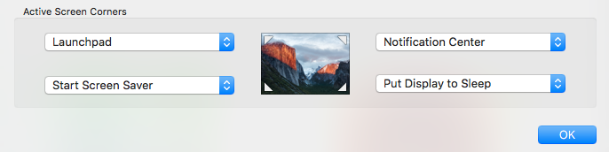
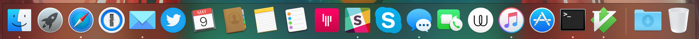

# Dotfiles

> My settings for new OS X installations

# Getting started

The first step is install the Xcode in the mac app store, after installed check if the `git` command is working.

# Apps

Apps that I use installed with the mac app store

- [Twitter](https://twitter.com)
- [Airmail](http://airmailapp.com)
- [Wire](https://wire.com)

# Fonts

You need to install the [FiraCode](https://github.com/tonsky/FiraCode) font in the `fonts` folder.

# Terminal Profile

You need to install the terminal profile in the `terminal` folder. After installed use the `FiraCode` font with the size 14.

# General

- Use the dark menu option in `System Preferences > General`.
- Use the ken burns effect on the screen saver.
- Enable the `Automatically show and hide the dock` option in `System Preferences > Dock`.
- Change the `require password` to `immeadiately` in `System Preferences > Security & Privacy`.
- Show the keyboard icon in the menubar

# Hot Corners

Set the hot corners in `System Preferences > Desktop & Screen Saver > Screen Saver`



# Dock organization

Define the position of the icons on the dock



# Install the other apps

```bash
./install.sh
```

After done continue to the next step below

`source ~/.zshrc`

# Languages

### Node.js

Install the node.js `6.1.0` and `4.4.3`.

```bash
nodenv install 6.1.0
```

Set as the global version

```bash
nodenv global 6.1.0
```

Now see if the version is correct: `node -v`.

### Python

Install the python `3.5.1`

```bash
pyenv install 3.5.1
```

**Note:** If you have any issue with the zlib try with the command below:

```bash
CFLAGS="-I$(xcrun --show-sdk-path)/usr/include" pyenv install -v 3.5.1
```

Set as the global version

```bash
pyenv global 3.5.1
```

Now see if the version is correct: `python -V`.

### Ruby

Install the ruby `2.3.1`.

```bash
rbenv install 2.3.1
```

Set as the global version

```bash
rbenv global 2.3.1
```

Now see if the version is correct: `ruby -v`.

### Golang

Install go `1.6.2`.

```bash
gvm install go1.4 -B
gvm use go1.4
export GOROOT_BOOTSTRAP=$GOROOT
gvm install go1.6.2
```

Set as the global version

```bash
gvm use 1.6.2 --default
```

Now see if the version is correct: `go version`.

**Note:** Rust, Elixir and Ocaml are already installed by `install.sh`.

# Final

Now you are ready to develop with your new OS X installation.

# LICENSE

Check [here](LICENSE.md).

